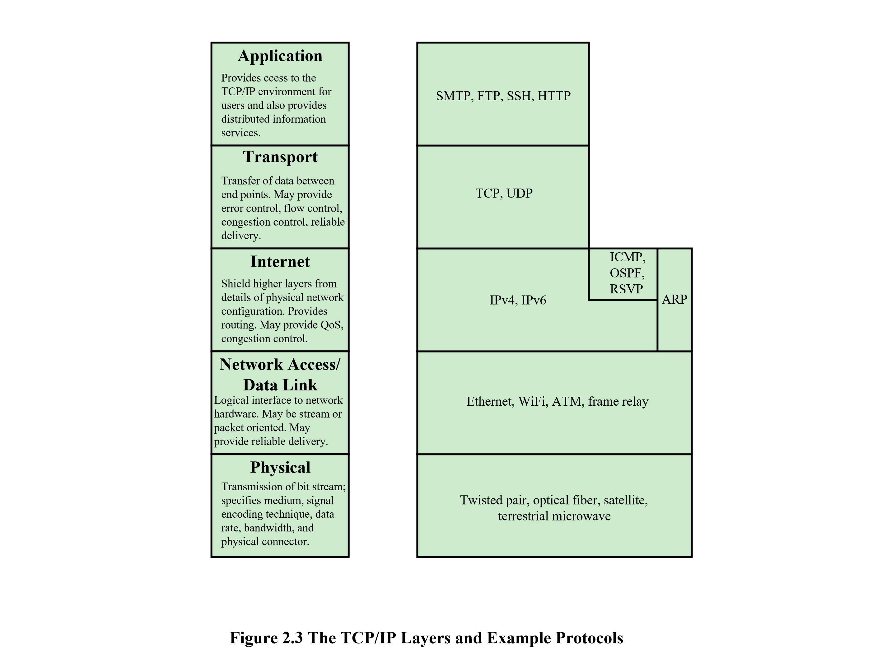

본 강의는 경북대학교 컴퓨터학부 [김동균](https://monet.knu.ac.kr/) 교수님의 데이터 통신 수업을 듣고 그 내용을 정리한 것입니다.

양질의 자료와 강의를 제공해주신 [김동균](https://monet.knu.ac.kr/) 교수님께 감사의 말씀 올립니다.

강의의 내용과 제가 공부한 내용에 기반하기 때문에 부정확한 정보가 있을 수 있는점 주의하시기 바랍니

# Protocol Architecture

  1.  Protocol Architecture의 필요성
    
        두 기기간의 데이터 교환이 일어나는 과정은 상당히 복잡하고, 많은 요구사항이 요구된다.

        다음은 데이터 교환을 위해 수행되어야하는 최소한의 작업들이다.

        - 발신 시스템은 데이터 전송로를 직접 가송 시키거나, 목적지 시스템의 식별자를 통신망에 알려야 한다.
        
        - 발신 시스템은 목적지 시스템이 데이터를 받을 준비가 되어 있는가를 확인해야 한다.

        - 발신 시스템의 파일 전송 응용프로그램은 목적지 시스템의 파일 관리 프로그램이 파일을 받아 저장할 준비가 되어잇는가 확인해야 한다.

        - 두 시스템에서 사용되는 파일 형식이다를 경우, 형식 변환이 수행되어야 한다.

        데이터 교환이 일어나려면 이처럼 두 시스템간의 고차원적인 상호 협력이 필요하다.

        이러한 작업을 하나의 모듈로 구현하는 것 보다는 여러개의 소규모 작업으로 나누어 구현하는것이 Error correction에 있어 유리하다.

        Protocol Architecture에서는 모듈은 vertical stack으로 쌓인다. 각 계층은 다른 시스템과 통신하는데 필요한 기능들 중 자신과 관련된 부분을 수행한다.

        각 계층은 자신의 하부 계층에서 제공하는 기본 서비스를 이용하며 하위 계층의 기능에 대한 자세한 사항은 알 필요가 없다.

        각 계층은 바로 위 사우이 계층에게 서비스를 제공한다.

        각 계층이 변경되더라도 다른 계층에는 전혀 영향을 주지 않도록 정의하는것이 가장 이상적이다.

        통신이 이루어지면 두 시스템의 동일한 계층끼리 Peer(동료)가 존재해야 하낟. Peer들은 Protocol이라고 불리는 정해진 규칙에 따라 일정한 형식의 데이터 블록들을 교환 함으로써 통신한다. Protocol의 3가지 Key Feature는 다음과 같다.

        - Syntax(문법) : 데이터 블록의 형태 
        
        - Semantics(의미론) : 조정과 오류 관리를 위한 제어정보
        
        - Timing(타이밍) : 속도 조절과 순서 조정

  2. 간단한 Protocol 구조

        일반적으로 데이터 통신은 Application, Computer, Network 3개의 에이전트를 포함한다.

        데이터가 전송될 때 Source의 Applciation에서 Computer, Network를 거쳐 Destination의 Computer에 도착하고 최종적으로 Destination의 Application에 도달하게 된다.

        이러한 개념을 적용하면 통신작업을 크게 독립적인 3개로 나눌 수 있다.

        -   Network access layer : Network와 Computer 간의 데이터 교환을 다룬다.

        -   Transport layer : mechanism을 common layer에 모아두고, application이 공유하도록 한다.

        -   Applicatin layer : application을 지원할 logic들을 담고 있다.

        

        

        위의 두 그림은 Protocol의 간단한 구조를 보여준다.

        올바른 통신을 위해서는 시스템 내의 모든 개체가 반드시 유일한 자신만의 주소를 가지고 있어야 한다.

        네트워크 상의 모든 컴퓨터는 자신만의 유일한 주소를 가지고 있고, 그 컴퓨터 위에서 동작하는 프로세스들 또한 유일한 주소를 가지고 있어야한다.

        프로세스들을 구별하는 주소를 Port또는 SAP(Service access point)라고 하며, Source에서는 Destination의 주소와 Port를 알고 있어야 통신이 가능하다.

        첫번째 그림은 각 컴퓨터의 Peer들이 Protocol을 사용하여 상대방과 통신한다는 것을 대략적으로 보여준다.

        이러한 통신이 이루어지기 위해서는 다양한 동작들이 수반되어야 하고 이를 제어할 정보또한 데이터와 함께 전송되어야 한다.

        두번째 그림은 각 계층에서 추가되는 제어 정보들과 이 제어 정보들이 통신에서 활용되는 방법을 나타낸 것이다.

        Application layer는 데이터 블록을 만들어 Transport layer로 넘긴다.

        Transport layer에서는 Header라를 데이터 블록에 붙여 Segment라고 불리는 PDU(Protocol Data Unit)로 만드는데 이러한 작업을 encapsulation이라고 한다.

        Header에 포함된 항목에는 다음과 같은것이 있다.

            - Source port : 데이터를 보내는 Applicaition을 가리키는 주소
            
            - Destination port : 데이터를 수신할 Application을 가리키는 주소
            
            - Sequence Number : 여러 데이터를 송신할 경우 데이터의 송신 순서

            - Checksum : Frame check sequence라고도 하며, 특정 연산을 통해 데이터의 무결성을 확인
            
            값이 일치하지 않을 경우 전송과정에서 데이터 손상이 일어났다는것을 의미

        Network layer에서는 Transport layer에서 전송받은 segment에 추가적인 정보를 붙여 Packet이라고 불리는 PDU를 만든다.

        Packet에서 추가된 항복에는 다음과 같은것이 있다.

            - Source Address : Packet의 발신지를 가리키는 주소
            
            - Destination Address : Network가 어떤 컴퓨터로 Packet을 전송해야 할지 알리는 주소

            - Service Request : NAP(Network Access Protocol)이 우선순위와 같은 Sub-network service를 사용할 수 있도록 정보를 담는 곳

         

    

# TCP/IP Protocol Architecture

    TCP/IP Protocol Architecture는 ARPANET에서 수행된 protocol 연구와 개발의 결과이다.

    TCP/IP protocol suit라고 불리우며, TCP/IP는 Internet의 표준인 대규모 Protocol을 구성한다.

  1. TCP/IP layer

    

      통신 시스템의 기본적인 목적은 두 사용자 간의 데이터를 교환하는 것이다.

      두 사용자가 통신을 하려면 다양한 조건들과 작업들이 필요하다. 

      아래는 통신이 이루어지는 동안 이루어지는 작업들을 정리한 것이다.
      
      
      1. Transmission system utilization(전송 시스템 활용)
          
          통신장비들간에 공유되는 전송설비의 효율적 사용을 위한 기술들(multiplexing, congestion control 등)

      2. interfacing(인터페이스 설립)
      
          interface : 의사소통이 가능하도록 만들어지는 물리적, 가상적 매개체

      3. Signal Generation(신호 생성)
      
         통신을 위한 신호 생성 -> 인터페이스에 적합하게 생성 되어야함

      4. Synchronization(동기화)
      
          송수신기 간의 정보 동기화가 과정, 신호의 phase(위상), 주파수, 시간, 코드 등을 일치시킨다.

      
      5. Exchange management(교환 관리)
      
          양측이 데이터를 교환할때 필요한 규약(동시전송 혹은 교대 전송, 한번에 전달하는 데이터의 양, 데이터의 형식 등)
      
      6. Error detection andcorrection(오류 검출 및 정정)
      
          전송과정에서 에러의 발생 여부를 판단하고, 발생한 에러에 대처해야함
      
      7. Flow control(흐름 제어)
      
          데이터 처리 및 수신 속도 보다 더 빠른 속도로 데이터를 전송하여 오버플로우가 발생하지 않도록 전송 속도를 조절
      
      8. Addressing(주소지정)
      
          발신시 목적지를 지정
      
      9. Routing(경로 배정)
      
          신호가 어떠한 경로(라우터, 기지국 등)를 거쳐 목적지에 도달할 것인가를 결정
      
      10. Recovery(복구)
      
          시스템 결함에 의해 작업이 중단된 경우 작업을 재개하거나 작업 시작 이전으로 되돌려 시스템의 상태를 복원한다.
      
      11. Message formatting(메시지 형식화) 
      
          전송되는 데이터의 형식을 정한다.
      
      12. Security(보안)
      
          지정된 수신자 만이 데이터를 열람하고, 데이터의 전송과정에서 변형이 없어야함
      
      13. Network management(망 관리)
      
          시스템을 구성하고 상태를 감시하고, 결함이나 과부화에 대처하며, 확장 가능성을 염두해 두고 망을 관리해야함

  2. 데이터 통신 모델

      아래 그림은 데이터 통신 과정을 단순화 시킨 것이다.

      

      사용자가 보내고자 하는 메시지 m은 컴퓨터의 입력장치를 통해 메모리 내의 비트집합 g로 변환된다.

      컴퓨터는 LAN 송수신기 또는 모뎀과 같은 입출력장치에 의해 전화회선 같은 전송 매체에 연결 되어 있다.

      입력 데이터 g는 통신 버스나 케이블 상에서 각 비트를 표현하는 전압 변이의 열g(t)로 송신기에 전달된다.

      송신기는 매체에 직접 연결되어 입력열g(t)를 전송에 적합한 신호s(t)로 변환시킨다.

      매체에 뿌려진 전송신호 s(t)는 수신기에 도달하기 전에 여러가지 손상을 입게 된다.

      따라서 수신신호 r(t)는 송신신호 s(t)와 완벽히 일치하지 않는다.

      수신기 r(t)는 매체에 대한 지식을 근거하여 원래의 신호 s(t)를 재현하려 한다.

      s(t)를 재현하여 탄생한 신호 s'(t)로 부터 비트열 g'(t)를 얻어낸다.

      전송과정에서 일어난 data loss가 복구되었다면 g'(t)에 담긴 메시지 m'는 원본 메시지 m을 완벽히 복사한 것일 것이다. 

      만약 그렇지 못하다면 오류가 없는 완전한 데이터를 얻기 위해 발신 시스템과 협조하여 데이터를 복구하고자 할 것이다.

  3. 전송 및 전송 매체
  
      현재 주로 사용되는전송 매체는 크게 두가지로 매체이다.

      1. Fiber optic transmission(광섬유 케이블)

          Fiber optic transmission은 유선 전송에서 사용되고 있으며

          정확성이 높고, BER(Bit Error Rate)가 10^-6 정도로 Wireless transmission에 비해 상대적으로 낮다.

      2. Wireless transmissions(무선 통신)

          무선 통신은 주로 Smartphone이나 Laptop과 같은 Mobile device에서 사용되는 전송 방식이다.

          유선 연결방식인 Fiber optic transmission보다 정확성이 낮고, BER이 10^-3으로 높은 편이다.

    

      컴퓨터/통신 설비의 주요 경비는 전송 경비이다.

      이 때문에 주어진자원을 통해 운반되는 정보량을 최대화 하거나 주어진 정보 통신 요구사항을 만족시키기 위해 필요한 전송 용량을 최소화 하여야 한다.

      이를 위한 방법이 Multiplexing과 Compression이다.

      Multiplexing은 다수의 기기가 하나의 전송 설비를 공유하는 기술이다.

      Multiplexing을 이용하면 한정된 전송 설비에서 한번에 전송되는 정보량을 최대화 시킬 수 있다.

      Multiplexing 기법은 FDM, TDM, WDM, ATDM, STDM, SDM, CDM 등이 있다.

      Compression은 데이터의 용량을 더 작게 축소시켜 전송 비용을 최소화 하는 기술이다.

  4. 네트워크 유형

      1. LAN(Local Area Networks)

          LAN은 다양한 장치를 상호 연결하는 통신망으로서, 이들 장치간의 정보 교환 수단으로 이용된다.

          LAN은 상대적으로 좁은 지역을 담당하며, WAN에 비해 높은 내부 데이터율을 보인다.

          LAN은 Ethernet을 주요 프로토콜로 사용하며 보통 100mbps 이상의 빠른 전송 속도를 보인다.

      2. WAN(Wide Area Networks)

          WAN은 넓은 지역을 담당하며, 공중 선로 부지를 거치고 공통 통신 사업자에 의해 제공되는 회선을 최소한으로 사용한다.

          통상적인 WAN은 여려 개의 교환 노드가 상호 연결되어 구성된다.

          WAN은 Point to Point 방식을 이용하여 다른 WAN과 연결되며, switched WAN을 이용하면 2개 이상의 네트워크에 연결 될 수 있다.

          

          위 그림은 통상적인 네트워크를 나타낸 것이다.

          LAN은 Router를 통해 WAN과 연결되고 WAN들은 Switched 또는 Point to Point 방식을 이용하여 다른 WAN과 연결된다.

          각각의 디바이스들은 LAN을 거쳐 Router를 통해 WAN에 연결되어 원하는 네트워크와 통신 할 수 있다.

          WAN의 데이터 전송 효율을 위해 사용되는 대표적인 4개의 기술은 다음과 같다.

          1. Circuit switching(회선 교환)

              Circuit switching은 송수신 단말 장치 사이에서 데이터를 전송 할 때 마다 통신 경로를 설정하여 데이터를 교환하는 방식이다.

              이 방법은 통신을 위해 회선 연결이 필요하며, 연결이 이루어지고 나면 통신이 이루어지는 동안 회선 전체를 독점하기 때문에 제3자가 통신에 개입할 수 없다.

              Circuit switching은 전화와 같은 실시간 통신에 사용되기 때문에 속도와 성능이 일정하다.

              이러한 방법은 통신 밀도가 높을 때 유리하고, 통신경로 설정이 매우 빠르다.

              하지만 속도차나 전송 밀도차가 큰경우 비효올 적이고 접속시간동안 통신 회선을 트래픽에 무관하게 독점사용한다는 문제점이 있다.
            
              Circuit switching에는 FDM과 TDM 두가지 방법이 있다.

              1. FDM(Frequency Division Multitasking, 주파수분할 다중화)

                  FDM 방식은 전송되어야 하는 신호들의 대역폭의 합보다 링크의 대역폭이 클때 적용할 수 있는 기법이다.

                  한 회선의 대역폭을 여러개의 작은 채널로 분할하여, 여러 단말기가 각 채널을 사용하는 방식이다.

                  넓은 도로를 여러개의 차선으로 나누는것과 같이, 넓은 대역폭을 여러개의 좁은 대역폭으로 나누어 사용하는 방식이다.

                  

                  FDM 방식은 특정 주파수 대역을 사용하는 기기가 정해져 있기 때문에 해당 주파수가 사용중이 아니더라도 지정된 기기가 아니라면 해당 주파수를 사용 할 수 없다는 단점이 있다.

                
              2. TDM(Time Division Multiplexing, 시분할 다중화)

                  링크의 높은 대역폭을 여러 연결이 공유 할 수 있도록 하는 디지털 과정이다.

                  TDM은 하나의 전송로 대역폭을 여러개의 Time slot으로 분할하여 채널에 할당함으로써, 몇개의 채널이 한 전송로의 시간을 분할 하여 사용할 수 있게 한다.

                  TDM 방식 또한 Time slot이 모두 할당되어 사용중이라면 새로운 통신이 불가능하다.

                  또한 Time slot이 사용중이지 않더라도 할당된 채널이 아니라면 해당 slot을 사용할 수 없다는 문제점이 있다.

                  

          2. Packet switching(패킷 교환)

              

              Packet Switching은 데이터를 Packet이라는 단위로 쪼개서 전송하는 방식이다.

              Packet은 다음 링크로 전송하기 전에 Buffer에 저장을 한 뒤 Header를 확인후 전달하는 Store and forward 방식을 사용한다.

              Packet의 Header에는 Source와 Destination 정보가 있다.

              Routing algorithm을 이용하여 경로를 설정하고, 중간의 Router들을 거쳐 Destination에 도달한다.

              만약 Router의 Buffer가 가득차면 buffering이 불가능하게 된다. 이때 Packet이 전송되면 Overflow가 일어나 packet loss가 발생한다.

              또한 회선 상황에 따라 전송된 순서대로 데이터가 도착하지 않을 수 도 있다. 이러한 문제를 Out of order delivery라고 한다.

          3. Frame relay(프레임 릴레이)

              Frame Relay는 전용선에 비해 저렴하고 적은 복잡성과 간단한 구현으로 망 구성 비용을 절감하게 해준다.

              또한 전용선에 비해 넓은 대역폭과, 높은 신뢰성, 유연성을 제공한다.

              프레임 릴레이는 가상회선을 사용하여 여려 개의 물리적 회선을 하나의 회선으로 대체하여 사용가능하다.

              이때 사용하는 대체 회선을 PVC(Permanent Virtual Circuit)이라고 한다.

              PVC는 논리적 경로로써 두 종단 사용자 간의 고유 경로를 정의한다.

              최대 2mpbs의 속도로 동작하고, 오류 제어를 위한 오버헤드를 제거하여 높은 데이터 전송률을 확보한다.

          4. Asynchronous Transfer Mode(ATM)

              ATM은 프레임릴레이로 부터 진화한 것으로, Cell relay라고 불리기도 한다.

              Circuit switching과 packet switching 개발의 정점에 있는 기술로써, cell이라고 불리는 고정된 길이의 Packet을 이용한다. 

              고정된 길이의 Packet인 cell은 Frame relay 방식보다 오류제어를 위한 오버헤드를 더 제거할 수 있기 때문에 수십 ~ 수백 Mbps에서 Gbps까지의 속도로 동작 할 수 있다.

              또한 ATM은 필요에 따라 동적으로 설정되는 Data rate를 가지는 다중 채널을 허용할 수 있어 Packet switching에 비해 효율적이다.
