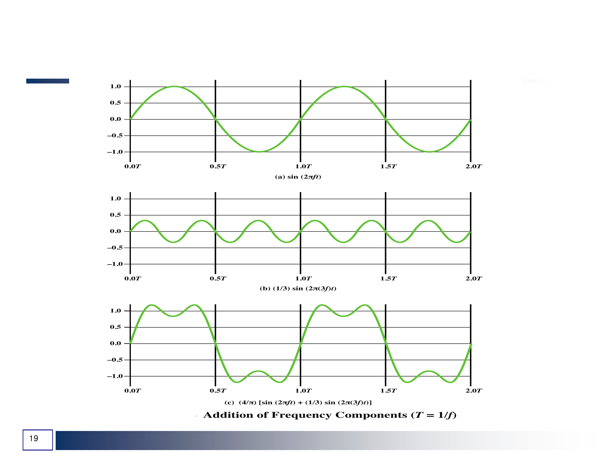
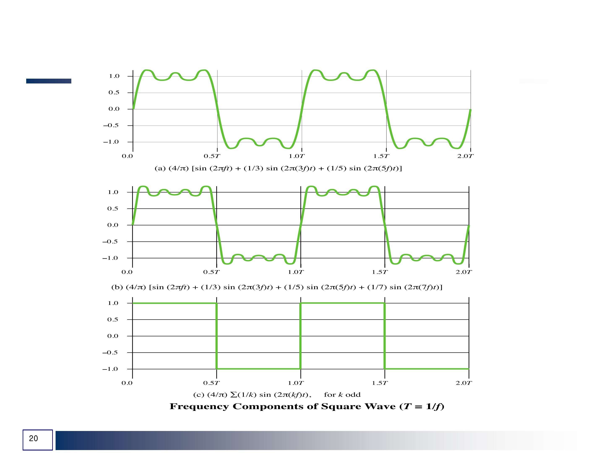

본 강의는 경북대학교 컴퓨터학부 [김동균](https://monet.knu.ac.kr/) 교수님의 데이터 통신 수업을 듣고 그 내용을 정리한 것입니다.

양질의 자료와 강의를 제공해주신 [김동균](https://monet.knu.ac.kr/) 교수님께 감사의 말씀 올립니다.

강의의 내용과 제가 공부한 내용에 기반하기 때문에 부정확한 정보가 있을 수 있는점 주의하시기 바랍니다.

# 개념 및 용어

  1. Analog와 Digital

      Data는 Analog와 Digital 2가지 종류가 있다.

      Analog data는 연속적인 정보를 뜻한다.

      Digital data는 불연속적인 정보를 나타낸다.

      Signal 또한 Analog와 Digital 2가지의 종류가 있다.

      Analog signal은 수 없이 많은 level을 가지고 있다.

      Digital signal은 제한된 개수의 정해진 level을 가지고 있다.

  2. Periodic Analog signal

      Periodic signal은 period라는 측정 가능한 시간 내에서 pattern을 완성하고, 동일한 period동안 해당 pattern을 반복한다.

      이러한 pattern을 cycle이라고 부른다.

      Non-periodic signal은 pattern이나 cycle의 반복 없이 바뀐다.

      Analog signal과 Digital signal 모두 periodic 할수도 있고 non-periodic할 수 도 있다.

      Periodic analog singal은 simple(단순)과 composite(복합)으로 구분된다.

      simple periodic analog signal은 sine wave이며 더 간단한 signal로 분해 될 수 없다.

      composite periodic analog signal은 다수의 sine wave가 composite된것이다.

      Simple Periodic signal인 sine wave는 3가지 특성을 가지고 있다.

      - Amplitutde(진폭)

         전송하는 signal의 에너지에 비례하는 가장 큰 세기의 절댓값

         전기 신호의 경우 V(전압)을 단위로 한다.

         시간 t에서 signal의 amplitude s는 다음과 같은 식을 따른다.

         $s(t) = Asin(2\pi ft + \phi)$ A는 Peak Amplitude, f는 frequency, $\phi$는 Phase를 뜻한다.

      - Period(주기)
        
         하나의 cycle을 완성하는데 필요한 시간이다.

         단위는 s(초)를 사용한다.

      - Frequency(주파수)

         시간에 대한 signal의 변화율을 뜻한다.

         짧은 시간 내의 변화는 High Frequency, 긴 기간에 걸친 변화는 Low frequency를 의미한다.

         만약 signal이 전혀 변화하지 않는다면 Frequency는 0이고, 순간적으로 변화하면 Limit이다.

         단위는 Hz(Hertz)를 사용한다.

         Period와 역수의 관계를 가지고 있다. $f = 1 / t$, $t = 1 / f$

      - Phase(위상)

         시간 0에 대한 파형의 상대적인 위치를 뜻한다.

         시간 축을 따라 앞뒤로 이동될 수 있는 파형에서 그 이동된 양을 뜻한다.

         첫 cycle의 상태를 표시한다.

      - wavelength(파장)

         signal이 한 period 동안 진행 할 수 있는 거리를 뜻한다.

         단위는 $\lambda$를 사용하며, $\lambda = c / f$의 식을 가진다. c는 전파 속도, f는 Frequency를 뜻한다.

  3. Time domain and Frequency domain

     signal을 표현하는 대표적인 두가지 방식에는 time domain과 frequency doamin 방식이 있다.

     일반적으로 우리는 그래프의 x 축이 Time을 나타내는 Time domain 방식을 주로 사용하였다.

     단일 signal으로 이루어진 simple signal의 경우 Time domain을 통해 표현하는데에 문제가 없지만 여러 Frequency가 합쳐져 생긴 composite signal을 표현하기에는 직관적이지 못하다는 단점이 있다.

     이러한 문제를 해결하기 위해 그래프의 x 축이 Frequency를 표현하고 y축이 Amplitude를 표현하는 Freqeucny domain을 사용한다.

     

     

     Frequency domain을 이용하면 여러 Frequency가 결합되어 있어도 이를 보기쉽게 나타낼 수 있고, Simple signal이라 하더라도 그래프의 구조가 한결 더 간단해 진다는 장점이 있다.
      

      

  4. Composite signal

     Simple signal은 에너지나 단순 signal을 전송하기에는 적합하지만 많은 정보를 전달하기는 어렵다.

     데이터 통신에서는 짧은 시간안에 많은 정보를 전달하는것이 중요하기 때문에 Composite signal을 이용하여 전달되는 정보양을 증가시키려 한다.

     Composite signal은 Fundamental frequency와 Fundamental Frequency의 배수 성분인 Harmonic으로 이루어진다.

     Harmonic이 증가하면 증가 할 수록 Signal에 담기는 정보의 양은 늘어나지만 Harmonic의 신호가 점차 약해진다는 단점이 있다.

     아래 그림은 Composite signal을 Time domain과 Freqeuncy domain으로 나타낸 것이다.

     

     이때 Composite signal의 Amplitude를 나타내는 식은 다음과 같다.

     $s(t) = A * 4/ \pi * \sum_{k odd, k = 1}^{n}sin(2\pi kft)/k$

     A는 Fundamental Frequency의 Peak Amplitude, n은 Harmonic의 개수, f는 Frequency, t는 time을 뜻한다.

     Composite signal에서 Harmonic이 증가하면 할 수록 Analog signal이 Digital Signal의 형태인 Square signal에 가까워지고, Harmonic의 개수가 무한대 일 때 Digital Signal의 파형과 같은 파형을 가지게 된다.

     

     

     Bandwidth(대역폭)은 Composite signal이 포함하고 잇는 Freqeucny의 범위를 나타내는 signal의 특성이다.

     Bandwidth는 대게 2개의 숫자의 차로 표현된다. 
     
     만약 signal이 400Hz ~ 1000Hz사이의 signal들로 이루어져 있다면, Bandwidth는 600Hz와 같이 표현된다.

     

  5. Digital signal
     
     정보는 Digital Signal로도 표현될 수 있다. Digital Signal은 0과 1의 두가지의 값을 사용하며, 1은 양전압으로, 0은 0전압으로 부호화 할 수 있다.

     Digital signal은 2개의 level보다 더 많을 수 있고, 이 경우에 각 level은 1 bit 이상을 전송하게 된다.

     

     위 그림은 2 level signal과 4 level signal의 모습을 나타낸 것이다.

     level이 늘어 남에 따라 level이 실어 나르는 정보의 양이 증가한다.

     2 level 방식에서 한 level은 1 bit를 표현하지만 4 level 방식에서 한 level은 2 bit를 표현한다.

     $2^n$ level을 가진 signal은 level당 n bit를 표현할 수 있다.

  6. Bit rate & bit Length

     대부분의 Digital signal은 nonperiodic 하기 때문에 Frequency와 Period가 signal을 표현하는 특성으로는 부적합하다.

     Digital signal을 표현하기 위해 Frequency를 대신해서 Bit rate(비트율)를 사용한다.

     Bit rate는 1초 동안 전송된 bit의 수이고, 단위로는 bps(bit per second)를 사용한다.

     또한 Analog signal에서 사용되던 Wave length를 대체하기 위해 Bit length(비트길이)라는 것을 사용한다.

     Bit length는 1 bit가 차지하는 거리를 뜻한다.

     $Bit length = propagation speed * bit duration$의 식을 가진다.

# 신호 전송

  1. Baseband & BroadBand

     Baseband(기저대역) 전송은 Digital signal을 Analog signal로 변환하지 않고 있는 그대로 채널을 통해 전송하는 방법이다.

     Baseband 방식은 Frequecy가 0에서 부터 시작하는 Bandwidth를 가진다. 

     Bit rate와 Bandwidth가 비례하기 때문에 빠른전송을 원한다면 더 넓은 bandwidth가 요구된다.

     이러한 이유 때문에 Digital을 Analog로 변조하지 않는 Dedicated medium을 통해 전송된다.

     전송시 사용되는 channel의 모든 Frequency를 독점하기 때문에 여러 단말기로 부터의 동시 데이터 전송이 불가능하다.

     Baseband 방식은 bandwidth가 넓은 low-pass channel을 사용하기 때문에 Digital siganl의 모양이 유지된다.

     

     위 그림은 2개의 low-pass channel을 나타낸 것이다.

     a channel의 경우 bandwidth가 넓어 Digital signal의 모양을 잘 유지한다. 하지만 실생활에서 이러한 채널을 구성하기는 쉽지 않다.
    
     또한 아무리 channel의 bandwidth가 넓다고 하더라도 무한대의 bandwidth를 가지는것은 불가능하기 때문에 실질적으로 output signal은 아래의 그림과 같이 왜곡된다.

     

     위 그림은 wide bandwidth channel에서의 signal transport를 나타낸 것이다. 

     channel의 bandwidth가 signal의 bandwidth 보다 좁기 때문에 output signal은 input signal과 완벽히 같을 수 없다.

     하지만 이러한 약간의 오차는 추론을 통해 input signal로 북구할 수 있다.

     하지만 a channel 처럼 넓은 bandwidth를 가지는것은 쉽지 않다 실제로는  b channel과 같이 bandwidth가 좁은 channel을 사용한다.

     이러한 경우에는 Digital signal과 근사한 Analog signal을 사용하게 되는데 근사의 정도는 bandwidth에 좌우된다.

     이때 최소로 요구되는 bandwidth는 bitrate / 2이다.

     

     위 그림은 bit rate가 N인 digital signal을 simple analog signal로 근사한 것이다.

     Composite signal을 이용한다면 근사값이 훨씬 Digial signal과 유사게 된다.

     아래 그림은 Composite signal을 이용하여 Digital signal을 근사한 것이다.

     

     Bandwidth를 N/2에서 5N / 2로 증가시켜 기존의 근사보다 더 정확한 근사가 이루어진 모습을 볼 수 있다.

     이처럼 Bandwidht를 증가시키면 Bitrate을 증가시켜 전송 속도를 증가시키고, Noise로 인한 distortion을 최소화할 수 있다.

     아래는 Bitrate당 요구되는 최소 Bandwidth를 나타낸 표이다. Bitrate이 증가할 수록, Harmonic이 늘어날 수록 요구되는 Banwidth가 증가함을 알 수 있다.

     

     Broadband 방식은 Digital signal을 Analog signal로 Modulation하여 전송하는 방식이다.

     Baseband 방식과달리 Frequency가 0에서 부터 시작하지 않는 Bandpass channel을 사용한다.

     Bandpass channel을사용함으로써 한 channel에서 동시에 많은 데이터를 각각의 Frequency band에 다른 signal을 할당하여 전송 할 수 있다는 장점이 있다.

     다만 Digital signal은 Frequency가 0에서 부터 시작하기 때문에 여러 signal을 담기 위해서 Frequency band의 변환가 필요하다.

     이때 이러한 변환을 Modulation이라고 하고 Modulation 과정은 전송할 signal을 Carrier signal에 실어 Frequency band를 이동시킨다.

     이 과정에서 signal의 low-pass channel이 Bandpass channel로 바뀌게 된다.

     Bandpass channel은 low-pass channel과 달리 Bandwidth의 시작값이 0가 아니다.

     

     이렇게 Modulation된 Signal은 Digital signal로 전송 될 수 없기 때문에 Analog signal로의 전환 하여 전송하게 된다.

     Broadband는 Baseband에 비해 Frequency가 높아지기 때문에 Noise등에 의한 signal의 간섭을 최소화 하고, 안테나의 길이를 단축 시킬 수 있다.

     또한 더 먼거리까지 전송이 가능하며, 한 통신로에 여러 Signal을 동시에 보낼 수 있다는 장점이 있다.

     아래는 Broadband 방식을 이용한 통신이 이루어지는 과정으로 각각 DAC 와 ADC를 이용하여 신호를 변환한다.

     

     

     

     

      1. Developmet of new services(새로운 서비스 개발)

      2. Advances in technology(기술의 발전)

      데이터 통신과 네트워크 기술은 위 세가지 원인을 통해 진화하고, 발전하게 된다.

      간단한 예를 들자면, 무선통신기술이 1,2세대에서 3세대로 발전하며, 음성과 텍스트 위주의 데이터가 사진과 영상, 음악과 같은 다양한 형태의 디지털 데이터를 지원하게 되었다.

      이러한 기술의 발전은 Youtube나 Facebook, Spotify, Netflix와 같은 서비스들이 개발 될 수 있는 원천이 되었고, 이러한 서비스들의 개발은 트래픽의 증가를 불러왔다.

      트래픽이 증가함에 따라 증가한 트래픽을 더 효율적으로 빠르게 처리하기 위해 4세대, 5세대 통신으로 무선 통신기술은 발전하게 되었고, 이러한 발전은 또 다시 새로운 서비스의 개발과 트래픽의 증가를 불러오게 된다.

  2. 전송 장애

     전송 장애는 Signal이 Medium을 통해 전송될 때 생기는 장애를 말한다.

     전송 장애에는 다음 3 가지 종류가 있다.

     1. Attenuation(감쇠)
         
         Attenuation은 Signal이 전송되며 발생하는 energy loss를 뜻한다.

         Signal이 Medium을 통해 전송될 때 Medium의 resistance로 인해 energy loss가 발생하게 된다.

         이로인해 손실된 energy는 열로 발산된다.

         Attenuation을 해결하기 위해서는 Amplifier를 설치하여 signal을 증폭시켜야 한다.

         다만 Signal에 Noise가 섞여있을 경우 Amplifier를 지나며 Noise 또한 증폭된다는 문제점이 있다.

         아래 그림은 signal이 attenuate되고 이후 amplifier를 통과하며 amplify되는 것을 나타낸 것이다.

         

         Decibel은 signal의 손실된 길이나 획득한 길이를 보기 위해 사용하는 단위로 dB로 나타낸다.

         2개의 다른 지점에서 signal의 상대적 길이를 측정한다.

         Signal이 감쇠하면 음수 값을 가지고, 증폭되면 양수 값을 가진다.
         
         $dB = 10\log10(p2/p1)$의 식을 가지고 p2와 p1은 신호의 전력을 나타낸다.

     2. Distortion(왜곡)

         Distortion은 Signal의 form이나 shape가 바뀌는것을 말한다.

         Distortiond이 발생하는 원인은 Composite signal을 구성하는 Frequency들이 각기 다른 Propagation speed를 가졌기 때문이다.

         이러한 이유 때문에 Composite signal을 동시간에 send 하더라도 완벽하게 같은 시간에 receive될 수 없기 때문에 Signal의 form이나 shape가 달라지게 되는것이다.

         이러한 Distortion은 Medium의 종류를 안다면 Medium의 특성에 따라 Phase를 조절해 해결 할 수 있다.

         아래 그림은 Signal이 Distortion된 모습을 그린것이다.

         

     3. Noise(잡음)

         Noise는 Signal에 어떠한 이유로 Noise가 섞여 Signal이 변하는 것으로 크게 아래 5종류의 Noise가 있다.

         1. Thermal Noise(열 잡음)

             Thermal Noise는 wire에서 전자의 움직임 때문에 발생한다. 전자의 움직임은 새로운 signal을 형성하고 이 signal이 Noise가 되는것이다.

         2. Impulse Noise(충격 잡음)

             Impulse Noise는 번개나 전선에서 발생하는 스파이크와 같은 사건들로 인해 발생하는 Noise이다.

             이러한 사건들은 굉장히 높은 Amplitude의 Short Signal을 생성하고 이것이 Noise가 되는 것이다.

         3. Induced Noise(유도된 잡음)

             Induced Noise는 모터와 같은 기구에서 반복적으로 생기는 Noise이다.

         4. Crosstalk(혼선)

             Crosstalk은 Signal이 전송되고 있는 wire 근처에 또다른 Wire로 인해 발생되는 Noise이다.

             근처에 위치한 wire들에서 발생하는 전기장과 자기장이 서로에게 영향을 미쳐 Noise를 발생시킨다.

         5. Intermodulation Noise(상호변조 잡음)

             Intermodulation Noise는 무선통신에서 서로 다른 Frequency의 signal들의 간섭으로 인해 발생하는 Noise이다.

         아래 그림은 Noise의 영향을 받은 signal을 나타낸 것이다.

         

         SNR(Signal to noise ration, 신호 대 잡음 비)는 Noise에 대한 Signal의 세기를 나타낸다.

         SNR은 Decibel로 표시되며 다음의 식으로 표현된다.

         $SNR = Average signal power / Average noise power$

         SNR이 높으면 Signal의 세기가 Noise에 비해 세다는 것이기 때문에 Noise가 있어도 Signal을 구별 할 수 있다.

         하지만 SNR이 낮다면 Signal의 세기에 비해 Noise의 세기가 센것이기 때문에 signal을 구별하기 어려워 진다.

  3. Data rate limit

     Data rate은 다음의 3요소에 의해 좌우된다.

       - Channel Bandwidth(B)
       
       - Number of available signal level(L)
       
       - Signal to noise ratio(SNR = Signal power / Noise power)

     Channel에는 이론적으로 Noiseless와 Noisy 두가지의 channel이 존재한다.

     Noiseless Channel의 경우 Nyquist Channel Capacity로 Data rate을 구할 수 있다.

     Nyquist capacity는 $C(bps) = 2 B * log_{2} L$의 식을 가진다.

     하지만 Noiseless channel은 실질적으로 불가능하다.

     Noisy channel의 경우 Shannon-Hartely Channel Capacity로 Data rate을 구할 수 있다.

     Shannon-Hartely capacity는 다음의 식을 가진다 $C(bps) = B * log_2 (1+SNR)$

     Shannon capacity는 전송의 한계를 알려주고, Nyquist capacity는 몇개의 level이 필요한지 알려준다.

  4. Performance

     Networking에 있어서 Performance는 굉장히 중요한 이슈중 하나이다.

     Performance를 결정하는 요소에는 다음과 같은것이 있다.

     1. Bandwidth(대역폭)

         Hz 단위의 Bandwidth는 composite signal에 포함된 channel이 통과 시킬 수 있는 영역을 뜻한다.

         bps 단위의 Bandwidth는 channel이 초당 통과 시킬 수 있는 초당 bit수를 뜻한다.

     2. Throughput(처리율)

         Througput은 얼마나 빨리 데이터를 보낼 수 있는 지에 대한 측정치이다.

         B 의 Bandwidth를 가진 channel은 T bps만큼만을 전송할 수 있을 때 T는 Throughput이다.

         또한 T의 값은 항상 B보다 작다.   
     
     3. Latency or Delay(지연)

         Delay는 발신지에서 첫 bit를 보낸 시간부터 전체 메시지가 목적지에 도달할 때까지의 시간이다.

         $Latency = propagation time + tranmission time + queuing time + processing delay$의 식을 가진다.

         - Propagation time(전파시간)

             bit가 발신지에서 목적지 까지 이동하는 시간

             propagation time = distance / propagation speed

         - Transmission time(전송시간)

             메시지를 전송하는데 걸리는 시간으로 메시지의 크기와 channel의 bandwidth에 좌우된다.

             Transmissin time = size of message / Bandwidth

             메시지의 크기는 패킷의 크기에 따라 다르기 때문에 Transmission time은 평균을 내 구한다.

         - queuing time(큐 시간)

             장치들이 메시지를 전송하기까지 붙들고 있는 시간

         - Processing tiem(처리시간)

             장치들이 메시지를 전송하기 위해 처리하는 시간

     4. Bandwidth-Delay product(대역폭 지연 곱)

         Bandwidth * delay의 값으로 주어진 시간에 최대로 Link에 있을 수 있는 bit의 개수를 뜻한다.

         link의 최대 용량을 이용하려면 2 * Bandwidth * delay의 크기 만큼 데이터를 전송하면 된다.

         아래 그림들은 Bandwidht * delay의 예이다.

         

         

     5. Jitter(파형 난조)

         Jitter는 서로다른 Packet이 서로다른 Delay를 가지게 되어 생기는 현상이다.

         주로 Audio나 Video처럼 시간에 민감한 Application이 주로 겪는 문제이다.

         만약 첫번째 packet의 delay는 20ms, 두번째는 45ms, 세번째는 40ms와 같은 상황에서 Jitter가 발생한다.

         Jitter는 Delay Variation이라고도 한다.